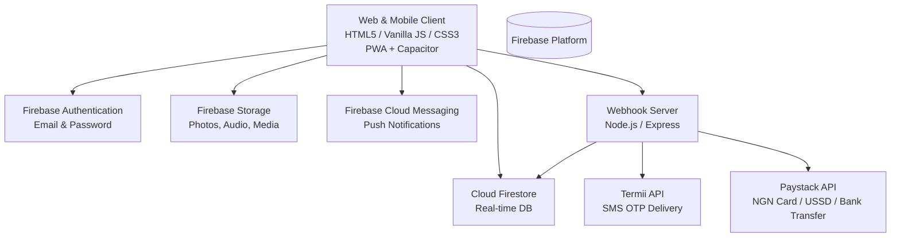

# hookmebysam — Complete A-to-Z Application Documentation

> **Product:** hookmebysam — Nigeria's #1 Premium Dating & Matchmaking Platform  
> **Repository:** `daveemin0-sudo/matchmaker`  
> **Version:** 1.0.0 (Production-Ready)  
> **Target Platforms:** Web (PWA), Android (Capacitor), iOS (Capacitor Ready)  
> **Author / Lead Developer:** daveemin0-sudo  

---

## Table of Contents

1. [Executive Summary & Product Vision](#1-executive-summary--product-vision)
2. [High-Level Architecture & Tech Stack](#2-high-level-architecture--tech-stack)
3. [Repository Directory & File Structure](#3-repository-directory--file-structure)
4. [A-to-Z Feature Breakdown](#4-a-to-z-feature-breakdown)
   - [A — Authentication & Onboarding](#a--authentication--onboarding)
   - [B — Blocking, Safety & Reporting](#b--blocking-safety--reporting)
   - [C — Chat & Real-Time Messaging](#c--chat--real-time-messaging)
   - [D — Discovery, Swiping & Filters](#d--discovery-swiping--filters)
   - [E — Emoji Reactions & Micro-Interactions](#e--emoji-reactions--micro-interactions)
   - [F — Forwarding & In-App Sharing](#f--forwarding--in-app-sharing)
   - [G — Gold / VIP Subscriptions & Paystack Payments](#g--gold--vip-subscriptions--paystack-payments)
   - [H — Header, Navigation & App Shell](#h--header-navigation--app-shell)
   - [I — Image Compression & Fast Upload Pipeline](#i--image-compression--fast-upload-pipeline)
   - [L — Local Offline Synchronization & State Management](#l--local-offline-synchronization--state-management)
   - [M — Matching Logic & Mutual Match Modals](#m--matching-logic--mutual-match-modals)
   - [N — Notifications (FCM Push & In-App Badges)](#n--notifications-fcm-push--in-app-badges)
   - [P — Profile Management & Personalization](#p--profile-management--personalization)
   - [S — Stories / Status (WhatsApp Style)](#s--stories--status-whatsapp-style)
   - [V — Voice Notes & Audio Recording](#v--voice-notes--audio-recording)
   - [W — WebRTC Calling Overlays (Audio & Video)](#w--webrtc-calling-overlays-audio--video)
5. [Cloud Firestore Data Models & Security Rules](#5-cloud-firestore-data-models--security-rules)
6. [Backend Webhook Server & Third-Party APIs](#6-backend-webhook-server--third-party-apis)
7. [Design System & UI Aesthetics](#7-design-system--ui-aesthetics)
8. [Mobile PWA & Capacitor Native Packaging](#8-mobile-pwa--capacitor-native-packaging)
9. [Installation, Environment Setup & Deployment](#9-installation-environment-setup--deployment)
10. [Troubleshooting & Maintenance Checklist](#10-troubleshooting--maintenance-checklist)

---

## 1. Executive Summary & Product Vision

**hookmebysam** is a modern, high-performance dating and matchmaking platform built tailored for the Nigerian and international diaspora market. It combines the tactile spontaneity of swipe-based discovery with the intimacy of WhatsApp-style 24-hour status stories, two-sided real-time messaging (with voice notes and image sharing), and server-verified Paystack VIP memberships.

### Key Pillars
- **Zero-Friction Discovery:** Instant touch swipe gestures, dynamic profile filtering by location radius, age, and interests.
- **WhatsApp-Style Stories:** 24-hour ephemeral statuses, multi-story support per user, instant client-side canvas compression (<150ms), and touch zone navigation (tap right to skip, tap left to reverse).
- **Two-Sided Real-Time Messaging:** Right-aligned sent messages in signature flame gradient (`#FF2D78`), left-aligned received bubbles in dark obsidian (`#1A1225`). Includes long-press action sheets, permanent deletion, editing, forwarding, in-app sharing to users, and emoji reactions with live counters.
- **Security & Integrity:** Robust Cloud Firestore security rules ensuring strict participant isolation for matches and messages, owner-only story write access, and server-side payment verification via Paystack webhooks.
- **Native-Like PWA:** Offline capability via Service Workers, web app manifests, Capacitor Android integration, and Firebase Cloud Messaging (FCM) background push notifications.

---

## 2. High-Level Architecture & Tech Stack



### Technology Breakdown
- **Frontend Core:** Vanilla JavaScript (ES2022+), Semantic HTML5, CSS3 with Custom Properties (variables). No heavy frameworks to ensure sub-second loads on mobile connections.
- **Backend / BaaS:**
  - **Firebase Auth:** Token-based authentication, password reset pipelines.
  - **Cloud Firestore:** NoSQL real-time document database with reactive listeners (`onSnapshot`).
  - **Firebase Storage:** Cloud bucket storage for chat attachments and profile photos.
  - **Firebase Cloud Messaging:** Web Push notifications with background service worker.
- **Microservices Server (Node.js/Express):**
  - **Termii Integration:** SMS OTP verification for Nigerian telephone numbers (`+234...`).
  - **Paystack Payment Gateway:** Secure payment initiation, transaction verification, and HMAC-SHA512 webhook signature validation.
  - **Firebase Admin SDK:** Server-side privileged operations (custom token generation, VIP status provisioning).
- **Mobile Container:**
  - **Capacitor 8.5+:** Wraps the web application into an installable native Android APK / iOS binary.

---

## 3. Repository Directory & File Structure

```text
Match making/
├── APP_DOCUMENTATION.md        # Comprehensive Master Documentation (This file)
├── capacitor.config.json       # Capacitor configuration for Native Android/iOS builds
├── firebase.json               # Firebase CLI deployment and hosting configuration
├── .firebaserc                 # Firebase project mapping ("hookmebysam")
├── firestore.rules             # Cloud Firestore security rules with granular ACLs
├── firebase-config.js          # Client-side Firebase SDK configuration and backend bridging
├── firebase-messaging-sw.js    # Background Service Worker for FCM push notifications
├── sw.js                       # Offline caching service worker for Progressive Web App
├── index.html                  # Single Page Application (SPA) DOM structure
├── script.js                   # Core business logic, routing, interactions, state machine
├── style.css                   # Primary stylesheet (luxury dark theme, layouts, animations)
├── premium.css                 # Supplementary styles for VIP Gold cards, luxury badges
├── manifest.json               # Web App Manifest for mobile home screen installation
├── logo.png                    # Brand emblem
├── Server.js                   # Standalone Termii OTP and Paystack webhook server
├── package.json                # Project npm manifest and scripts
├── webhook-server/             # Microservice server directory
│   ├── index.js                # Express webhook server entry point
│   ├── package.json            # Webhook dependencies (cors, dotenv, express, firebase-admin)
│   ├── .env.example            # Template for server-side API keys and secrets
│   └── README.md               # Webhook deployment instructions (Railway / Render / VPS)
└── icons/                      # App icon assets (192x192, 512x512 PNGs)
```

---

## 4. A-to-Z Feature Breakdown

### A — Authentication & Onboarding
1. **Email & Password Authentication:**
   - Supported via `firebase.auth().signInWithEmailAndPassword()` and `createUserWithEmailAndPassword()`.
   - Real-time client-side validation for email formats and password length.
2. **Phone Number OTP (Termii):**
   - Nigerian users can enter their mobile phone number (`080...` or `+234...`).
   - The frontend communicates with `/api/otp/send` on the webhook server, dispatching a 6-digit PIN via Termii SMS.
   - Upon verification via `/api/otp/verify`, a Firebase custom token is returned to establish a verified session.
3. **Forgot Password:**
   - Dedicated reset password modal with direct Firebase password reset email delivery (`sendPasswordResetEmail`).
4. **Guest Mode & Demo State:**
   - One-click exploration for unauthenticated visitors, populating curated mock discovery cards with safe offline states.

### B — Blocking, Safety & Reporting
1. **Blocked Contacts Directory:**
   - Accessible in Settings (`#blockedContactsModal`).
   - Users can review all blocked profiles and unblock them with instant UI synchronization.
2. **Profile Reporting:**
   - Users can flag abusive profiles from the chat menu or discover card.
   - Saves incident reports to the Firestore `/reports` collection for administrative review.
3. **Safety Guidelines:**
   - Built-in Safety Tips modal covering meeting in public, guarding financial info, and reporting harassment.

### C — Chat & Real-Time Messaging
1. **Two-Sided Chat Thread:**
   - Sent messages align to the right in vivid flame gradient with double checkmarks (`✓✓`).
   - Received messages align to the left in dark obsidian with light contrast typography.
2. **Action Sheet (Long Press / Right Click):**
   - Holding down on mobile or right-clicking on desktop displays a sleek glassmorphic action sheet anchored to the message.
   - Isolated with a full-screen `.msg-action-backdrop` (`z-index: 99998`), preventing unwanted accidental dismissal on touchscreen devices.
3. **Message Deletion:**
   - Permanent deletion supported both locally and in Firestore (`/matches/{matchId}/messages/{messageId}`).
   - Syncs across devices; deleted messages do not reappear.
4. **Message Editing:**
   - Sent text messages can be modified.
   - Displays an inline `(edited)` indicator and updates Firestore in real time.
5. **Auto-Reordering to Top:**
   - Receiving or sending a message automatically moves the partner to the top of the conversation list.
6. **Full-Screen Photo Viewer:**
   - Tapping an image attachment in chat opens a high-resolution lightbox with zoom and dismiss controls.

### D — Discovery, Swiping & Filters
1. **Interactive Card Stack:**
   - Smooth CSS transforms and touch gesture physics (drag, rotate, spring back).
2. **Swipe Actions:**
   - **Swipe Right / Like:** Registers approval. If mutual, triggers the "It's a Match!" celebration modal.
   - **Swipe Left / Pass:** Dismisses the card and moves to the next profile.
   - **Superlike:** Sends high-priority intent with celebratory star animation.
3. **Discovery Filters:**
   - Filter by Gender preference (Men, Women, Everyone).
   - Age Range slider (18 to 65+).
   - Maximum Distance radius (up to 100+ km).
   - Lifestyle Interests (Foodie, Tech, Travel, Fitness, etc.).

### E — Emoji Reactions & Micro-Interactions
1. **Floating Reaction Bar:**
   - Quick reaction selector on message long-press with 6 curated emojis: ❤️, 😂, 😮, 😢, 👍, 🔥.
2. **Persistent Reaction Pills:**
   - Reactions render directly below the bubble with active counters.
   - Tapping a pill toggles the reaction for the authenticated user, synchronizing via Firestore transactions.

### F — Forwarding & In-App Sharing
1. **Forward to Contact:**
   - Clicking Forward brings up the Contact Picker modal listing mutual matches and active profiles.
   - Duplicates the message (text, photo, or voice note) and delivers it to the selected recipient's chat.
2. **Share to User:**
   - Share any profile or message snippet directly to other connections in the app.
3. **Native Web Share / Clipboard Copy:**
   - One-tap copying to clipboard with confirmation toast, plus native OS share sheet triggering where supported.

### G — Gold / VIP Subscriptions & Paystack Payments
1. **VIP Gold Tier:**
   - Unlocks Unlimited Swipes, Passport / Travel Mode, Who Liked You preview, and Priority Likes.
2. **Paystack Integration:**
   - Client initializes Paystack inline checkout popup configured with the public key.
   - Webhook server listens for `charge.success` events, validates HMAC signatures, and automatically grants VIP status in Firestore.
3. **Synchronized VIP State:**
   - Automatically reflects across all screens (App Header badge, Discovery card frames, Profile badge).

### H — Header, Navigation & App Shell
1. **Unified Navigation Bar:**
   - Fixed mobile bottom dock with tactile icons: Discover (Flame), Matches/Chats (Chat Bubble), Stories (Camera/Ring), Profile (User).
2. **Dynamic Header:**
   - Contextual back button, screen title, and glowing VIP badge.
3. **Responsive Viewport Fitting:**
   - Configured with `viewport-fit=cover` and iOS safe area padding to prevent UI collision with device notches.

### I — Image Compression & Fast Upload Pipeline
1. **Client-Side Canvas Downscaling (`compressStoryImage`):**
   - High-resolution smartphone camera photos (5–15 MB) are resized via an off-screen `<canvas>` to a maximum dimension of 1080px at 0.78 JPEG quality.
   - Reduces execution time to **<150ms** and file size to **~120 KB**.
   - Solves upload latency and completely eliminates Firestore 1 MB document quota errors.

### L — Local Offline Synchronization & State Management
1. **`appState` Object:**
   - Centralized memory store managing current tab, active chat ID, swipe history, and filters.
2. **LocalStorage Caching:**
   - User profile (`hmbs_profile`), conversation histories (`hmbs_conversations`), and stories (`hmbs_user_stories`) are cached locally for instantaneous offline startup.

### M — Matching Logic & Mutual Match Modals
1. **Mutual Like Detection:**
   - When a user likes a profile, the client records the swipe in `/swipes`.
   - Checks if the target user has already swiped right; if detected, a document is created in `/matches/{matchId}`.
2. **Celebration Overlay:**
   - Triggers particle confetti, displays dual interlocking avatars, and provides instant "Send a Message" and "Keep Swiping" buttons.

### N — Notifications (FCM Push & In-App Badges)
1. **Real-Time Matches Badge:**
   - Red notification pill beside the navigation logo indicating unread messages and new matches.
2. **FCM Push Notifications:**
   - Browser service worker (`firebase-messaging-sw.js`) receives background push notifications when the app is closed.

### P — Profile Management & Personalization
1. **Editorial Profile Design:**
   - Cover gallery, bio editor, verification status badge, occupation, education, and interest tags.
2. **Photo Management:**
   - Fast avatar upload and instant thumbnail preview.

### S — Stories / Status (WhatsApp Style)
1. **24-Hour Expiration:**
   - Stories automatically expire 24 hours after creation.
2. **Multiple Stories Per User:**
   - Users can post multiple photos; each upload appends to their status stack.
3. **Segmented Progress Indicators:**
   - Top progress bar splits into individual segment dashes representing each story slice.
4. **Touch Zone Navigation:**
   - **Tap Right Half:** Advances to the next slice (or next user's status).
   - **Tap Left Half:** Goes back to the previous slice.
5. **Community Story Feed:**
   - Real-time listener (`listenToCommunityStories`) displays live stories from other authenticated members alongside preset profiles.
6. **Individual Story Deletion:**
   - Delete button removes the active slice while continuing playback of remaining stories.

### V — Voice Notes & Audio Recording
1. **MediaRecorder API Integration:**
   - Native microphone capture recording audio in WebM/Ogg format.
2. **Live Waveform & Timer:**
   - Visual recording bar with timer during audio capture.
3. **In-Chat Audio Player:**
   - Custom playback controls with duration display and progress indicator.

### W — WebRTC Calling Overlays (Audio & Video)
1. **Voice Calling Overlay:**
   - Avatar pulse animations, call duration timer, microphone mute, speaker toggle, and end call button.
2. **Video Calling Overlay:**
   - Fullscreen remote video feed, local Picture-in-Picture (PiP) camera preview, and camera flip controls.

---

## 5. Cloud Firestore Data Models & Security Rules

### Data Schemas

#### 1. `/users/{userId}`
```json
{
  "name": "David",
  "age": 26,
  "gender": "man",
  "location": "Lekki, Lagos",
  "bio": "Product designer and music enthusiast.",
  "avatar": "https://storage.googleapis.com/...",
  "interests": ["Design 🎨", "Afrobeats 🎵", "Travel ✈️"],
  "isVip": true,
  "createdAt": "Timestamp"
}
```

#### 2. `/matches/{matchId}`
*Note: `matchId` is deterministic: `[uid1, uid2].sort().join('_')`*
```json
{
  "users": ["uid_1", "uid_2"],
  "createdAt": "Timestamp",
  "lastMessage": "Hey! How is your day going?",
  "lastSender": "uid_1",
  "lastUpdated": "Timestamp"
}
```

#### 3. `/matches/{matchId}/messages/{messageId}`
```json
{
  "sender": "uid_1",
  "text": "Are we still meeting at the café?",
  "imageUrl": "",
  "isVoice": false,
  "audioUrl": "",
  "duration": "",
  "read": true,
  "reactions": {
    "❤️": ["uid_2"]
  },
  "edited": false,
  "deleted": false,
  "timestamp": "Timestamp"
}
```

#### 4. `/stories/{storyId}`
```json
{
  "ownerId": "uid_1",
  "ownerName": "Amaka",
  "ownerAvatar": "https://...",
  "mediaUrl": "https://...",
  "mediaType": "image",
  "location": "Victoria Island, Lagos",
  "bio": "Brunch vibes ✨",
  "tags": ["Foodie 🍕", "SundayVibes"],
  "createdAt": "Timestamp",
  "expiresAt": "Timestamp",
  "viewCount": 14
}
```

#### 5. `/swipes/{swipeId}`
```json
{
  "fromUserId": "uid_1",
  "toUserId": "uid_2",
  "action": "like",
  "timestamp": "Timestamp"
}
```

---

### Firestore Security Rules (`firestore.rules`)

```javascript
rules_version = '2';
service cloud.firestore {
  match /databases/{database}/documents {

    function isSignedIn() {
      return request.auth != null;
    }

    function isOwner(userId) {
      return isSignedIn() && request.auth.uid == userId;
    }

    // Profiles: Anyone authenticated can read; only owner can write
    match /users/{userId} {
      allow read:           if isSignedIn();
      allow create, update: if isOwner(userId);
      allow delete:         if isOwner(userId);
    }

    // Swipes: Immutable records created by sender
    match /swipes/{swipeId} {
      allow create: if isSignedIn() && request.resource.data.fromUserId == request.auth.uid;
      allow read:   if isSignedIn();
    }

    // Matches & Real-Time Messages
    match /matches/{matchId} {
      allow read, update: if isSignedIn() && request.auth.uid in resource.data.users;
      allow create:       if isSignedIn() && request.auth.uid in request.resource.data.users && request.resource.data.users.size() == 2;

      match /messages/{messageId} {
        allow read:           if isSignedIn() && request.auth.uid in get(/databases/$(database)/documents/matches/$(matchId)).data.users;
        allow create:         if isSignedIn() && request.resource.data.sender == request.auth.uid && request.auth.uid in get(/databases/$(database)/documents/matches/$(matchId)).data.users;
        allow update, delete: if isSignedIn() && request.auth.uid in get(/databases/$(database)/documents/matches/$(matchId)).data.users;
      }
    }

    // 24h Ephemeral Stories
    match /stories/{storyId} {
      allow read:           if isSignedIn();
      allow create:         if isSignedIn() && request.resource.data.ownerId == request.auth.uid;
      allow update, delete: if isSignedIn() && resource.data.ownerId == request.auth.uid;
    }

    // Reports
    match /reports/{reportId} {
      allow create, read: if isSignedIn();
    }
  }
}
```

---

## 6. Backend Webhook Server & Third-Party APIs

The webhook service (`Server.js` / `webhook-server/index.js`) bridges server-side operations that require secret keys.

### Endpoints

| Method | Endpoint | Description | Headers / Auth |
|---|---|---|---|
| `GET` | `/health` | Server uptime check | None |
| `POST` | `/api/otp/send` | Dispatches 6-digit PIN via Termii SMS | `phone` |
| `POST` | `/api/otp/verify` | Validates PIN & returns Firebase auth token | `phone`, `pin` |
| `POST` | `/api/paystack/initialize` | Creates Paystack transaction session | Bearer JWT |
| `POST` | `/webhook/paystack` | Webhook receiver verifying Paystack signature | `x-paystack-signature` |
| `POST` | `/api/notifications/send` | Dispatches push notifications via Firebase Admin | Internal |

### Paystack Webhook Security (HMAC-SHA512)
```javascript
const crypto = require('crypto');
const hash = crypto.createHmac('sha512', process.env.PAYSTACK_SECRET_KEY)
                   .update(JSON.stringify(req.body))
                   .digest('hex');

if (hash !== req.headers['x-paystack-signature']) {
  return res.status(401).send('Invalid signature');
}
```

---

## 7. Design System & UI Aesthetics

- **Color Palette:**
  - **Background Deep:** `#0A0710` (Obsidian Violet)
  - **Card Surface:** `#140D21` with 1px border `rgba(255, 255, 255, 0.08)`
  - **Flame Primary Gradient:** `linear-gradient(135deg, #FF2D78 0%, #FF6B4A 100%)`
  - **VIP Gold Gradient:** `linear-gradient(135deg, #E5A93C 0%, #F5D77F 50%, #C98A2C 100%)`
  - **Text Primary:** `#FFFFFF` (100% white)
  - **Text Secondary:** `rgba(255, 255, 255, 0.65)`
- **Typography:**
  - **Display / Editorial Headings:** `Fraunces` (variable serif with warm character)
  - **Body / Interface:** `Plus Jakarta Sans` (clean geometric sans-serif)
- **Glassmorphism & Shadows:**
  - Backdrop filters with `blur(16px)` and `-webkit-backdrop-filter: blur(16px)`.
  - Multi-tier elevation: `box-shadow: 0 18px 50px rgba(0, 0, 0, 0.85)`.

---

## 8. Mobile PWA & Capacitor Native Packaging

### Progressive Web App (PWA)
- **Manifest (`manifest.json`):** Defines standalone display mode, orientation (`portrait`), and splash branding colors.
- **Service Worker (`sw.js`):** Intercepts offline requests and caches app shell assets while skipping during local development.

### Native Android Build (Capacitor)
Configured in `capacitor.config.json`:
```json
{
  "appId": "com.hookmebysam.app",
  "appName": "hookmebysam",
  "webDir": ".",
  "bundledWebRuntime": false
}
```

To sync and build the Android APK:
```bash
# 1. Sync web assets with native project
npx cap sync android

# 2. Open Android Studio to compile APK
npx cap open android
```

---

## 9. Installation, Environment Setup & Deployment

### Local Development Setup

1. **Clone repository:**
   ```bash
   git clone https://github.com/daveemin0-sudo/matchmaker.git
   cd matchmaker
   ```
2. **Install dependencies:**
   ```bash
   npm install
   cd webhook-server && npm install && cd ..
   ```
3. **Configure Environment Variables (`webhook-server/.env`):**
   ```ini
   PORT=3001
   TERMII_API_KEY=your_termii_api_key
   TERMII_SENDER_ID=N-Alert
   PAYSTACK_SECRET_KEY=sk_live_...
   ALLOWED_ORIGINS=http://127.0.0.1:5500,https://hookmebysam.com
   FIREBASE_SERVICE_ACCOUNT_BASE64=base64_encoded_service_account_json
   ```
4. **Start Local Servers:**
   ```bash
   # Starts static frontend on http://127.0.0.1:5500
   npm start

   # In a separate terminal, start the webhook server
   npm run server
   ```

### Production Deployment
- **Frontend:** Hosted via Firebase Hosting (`firebase deploy --only hosting`) or Vercel (`vercel --prod`).
- **Security Rules:** Deployed via `firebase deploy --only firestore:rules`.
- **Webhook Backend:** Deployed to Railway, Render, or any Node.js hosting platform with the `.env` variables configured.

---

## 10. Troubleshooting & Maintenance Checklist

| Issue | Cause | Fix |
|---|---|---|
| Chat action sheet closes instantly on phone | Global touch event listener dismisses popup before click | Use `.msg-action-backdrop` and `stopPropagation` on popup (Already resolved in `script.js`). |
| Deleted messages reappear on PC | Firestore rules reject delete OR listener re-inserts | Ensure `firestore.rules` has `allow update, delete` and `listenToRealtimeMessages` filters `deleted: true`. |
| Story upload takes too long | Uploading uncompressed 10 MB smartphone photos | Off-screen canvas compression downscales images to 1080px JPEG (~120 KB) in <150ms. |
| Stories missing from other users | Missing `stories` Firestore collection security rule | Ensure `match /stories/{storyId}` has `allow read: if isSignedIn()`. |
| Paystack webhook 401 error | Mismatched secret key or raw body parsing error | Confirm `PAYSTACK_SECRET_KEY` matches Paystack Dashboard and raw payload is hashed. |
| Termii SMS not delivering | Sender ID not approved or insufficient balance | Check Termii dashboard balance and use default `N-Alert` for staging tests. |

---

*Documentation maintained by daveemin0-sudo. For issues and contributions, visit the repository: [github.com/daveemin0-sudo/matchmaker](https://github.com/daveemin0-sudo/matchmaker).*
